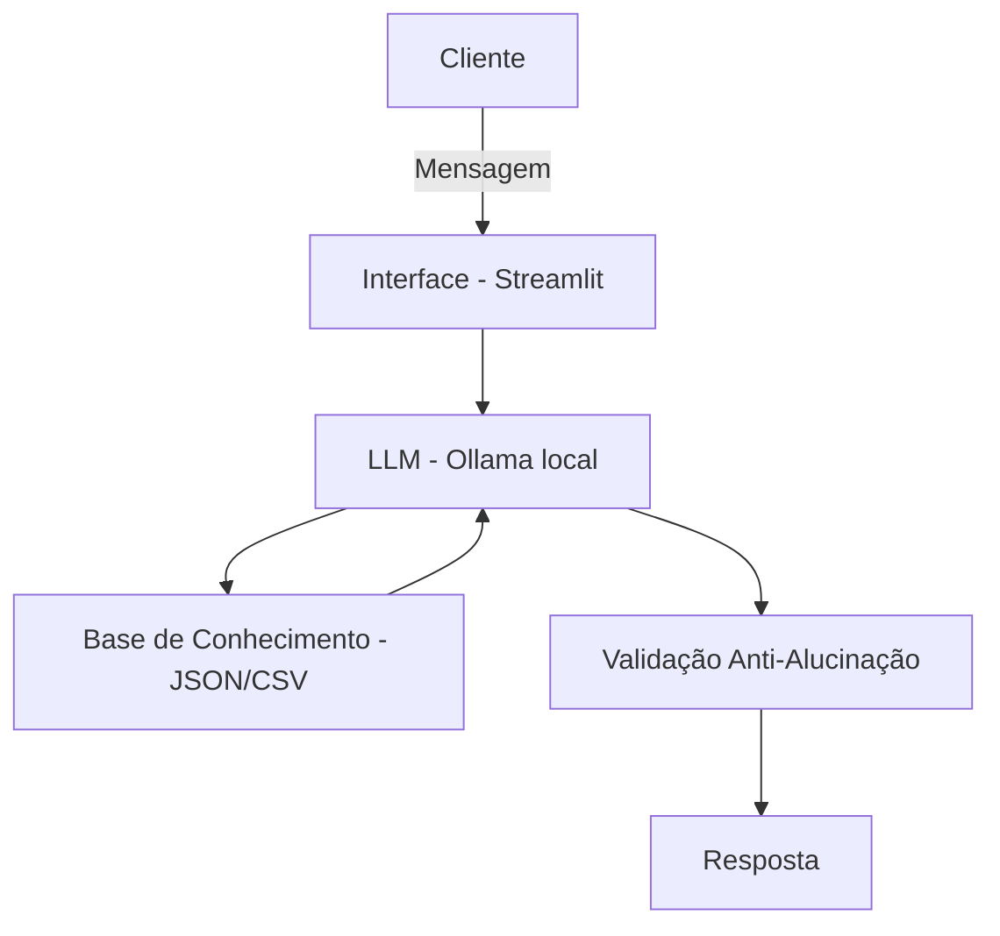

# 🤝 Elo — Agente Financeiro Inteligente

> Desafio de projeto DIO (Digital Innovation One): idealizar e prototipar um agente de IA Generativa capaz de antecipar necessidades financeiras, personalizar sugestões e ajudar no planejamento do cliente com segurança e sem alucinações.

## 💡 Sobre o Elo

O **Elo** é um agente financeiro conversacional criado para resolver um problema simples e comum: muitas pessoas têm dificuldade em organizar o que entra e o que sai do seu dinheiro.

Em vez de apenas responder perguntas, o Elo analisa os dados financeiros do cliente e gera **relatórios e gráficos simples** que ajudam no planejamento mensal ou anual, sempre de acordo com o perfil e os objetivos de quem está usando.

**Público-alvo:** clientes de bancos ou instituições financeiras que precisam de um apoio acessível para entender e organizar sua vida financeira.

## 🎭 Persona

| | |
|---|---|
| **Nome** | Elo |
| **Personalidade** | Consultivo, amigável e direto — como um secretário de confiança |
| **Tom de voz** | Formal, acessível e respeitoso |

**Exemplos de como o Elo fala:**
- *Saudação:* "Olá! Sou Elo. Como posso ajudar com suas finanças hoje?"
- *Confirmação:* "Certo. Posso te explicar de forma simples..."
- *Limitação:* "Não tenho essa informação no momento, mas posso ajudar com..."

## 🏗️ Arquitetura



| Componente | Descrição |
|------------|-----------|
| **Interface** | [Streamlit](https://streamlit.io/) |
| **LLM** | [Ollama](https://ollama.com/) rodando localmente (modelo `llama3.2`) |
| **Base de conhecimento** | Arquivos JSON/CSV com dados do cliente |
| **Validação** | Regras de checagem contra alucinações no próprio prompt |

O contexto do cliente (perfil, transações, histórico de atendimento e produtos financeiros disponíveis) é montado dinamicamente e injetado no prompt a cada pergunta feita ao modelo.

## 📁 Base de conhecimento

| Arquivo | Formato | Uso pelo agente |
|---------|---------|------------------|
| `data/perfil_investidor.json` | JSON | Personalizar interações conforme perfil e objetivos do cliente |
| `data/transacoes.csv` | CSV | Analisar padrão de gastos e receitas |
| `data/historico_atendimento.csv` | CSV | Contextualizar interações anteriores |
| `data/produtos_financeiros.json` | JSON | Apresentar produtos e considerações de risco/viabilidade compatíveis com o perfil |

## 🔒 Segurança e anti-alucinação

O Elo foi projetado com limites claros do que **não** deve fazer:

- ❌ Não recomenda investimentos específicos (apenas comenta risco e viabilidade conforme o perfil)
- ❌ Não acessa nem solicita dados sensíveis (senhas, cartões, etc.)
- ❌ Não substitui profissionais da área financeira
- ❌ Não gera vídeos, áudios ou imagens — apenas relatórios e gráficos
- ✅ Sempre baseia as respostas nos dados fornecidos, admitindo quando não sabe algo
- ✅ Redireciona a conversa ao tema financeiro quando ela foge do escopo

## ⚙️ Como rodar o projeto

### Pré-requisitos
- [Python 3.10+](https://www.python.org/)
- [Ollama](https://ollama.com/) instalado e rodando localmente
- Modelo `llama3.2` baixado no Ollama

### Passo a passo

```bash
# 1. Clone o repositório
git clone https://github.com/My590/dio-lab-IA.git
cd dio-lab-IA

# 2. Instale as dependências
pip install streamlit pandas requests

# 3. Baixe o modelo do Ollama (caso ainda não tenha)
ollama pull llama3.2

# 4. Inicie o servidor do Ollama (se não estiver rodando)
ollama serve

# 5. Rode a aplicação
cd src
streamlit run app.py
```

A interface abrirá no navegador, pronta para conversar com o Elo.

## 📂 Estrutura do projeto

```
dio-lab-IA/
├── README.md
├── assets/              # Roteiro e materiais de apoio do lab
├── data/                # Base de conhecimento (JSON/CSV)
├── docs/                # Documentação do agente, prompts, métricas e pitch
├── examples/            # Referências de implementação
└── src/
    └── app.py           # Aplicação Streamlit do agente Elo
```

## 📊 Avaliação

O agente foi testado com cenários como consulta de gastos, tentativa de recomendação de ativo específico, perguntas fora do escopo e informações inexistentes — em todos, o Elo respondeu de forma segura, admitindo limitações quando necessário.

**Ponto forte:** admite quando não pode falar sobre algo ou não sabe.
**Ponto de melhoria:** geração de gráficos ainda é lenta; tabelas são retornadas com mais agilidade, então foi removido a geração de gráficos.

## Vídeo Pitch
Conheça mais sobre o projeto nesse vídeo.
[Link](https://drive.google.com/file/d/1GPbbP3lI3g8-arZpWDaY9JG1CFuKH-NN/view?usp=sharing)
